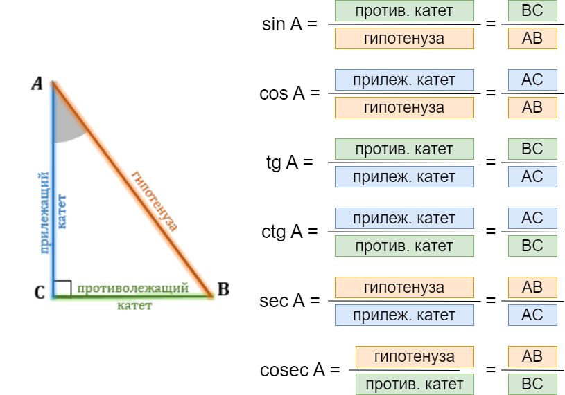
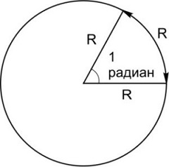

# Тригонометрия
В данном репозитории (хранилище) находятся материалы, предназначенный для подготовки к ЕГЭ по математике в части ***тригонометрии***.
> **ТРИГОНОМЕТРИЯ** – математическая дисциплина, изучающая зависимости между углами и сторонами треугольников, а также тригонометрические функции.  
> Тригонометрические функции нашли применение в математическом анализе, физике, химии, технике – везде, где приходится иметь дело с периодическими процессами и колебаниями – будь то акустика, оптика или качание маятника.
## 🧩 Содержание
- [Введение. Базовые понятия](#введение-базовые-понятия)
- [Lists and tables in HTML](#lists-and-tables-in-html)
- [HTML tags, classes, ids](#html-tags-classes-ids)
- [Flow and block model](#flow-and-block-model)
- [Padding and margin shortcut](#padding-and-margin-shortcut)
- [Borders](#borders)
- [Shadows](#shadows)
- [Introduction to JS](#introduction-to-js)
- [Useful links](#useful-links)

## Введение. Базовые понятия
### 1. Тригонометрические функции
Поскольку все прямоугольные треугольники с заданным острым углом подобны друг другу, отношения их соответственных сторон одинаковы. 

Отношения различных пар сторон прямоугольного треугольника и называются **тригонометрическими функциями** его острого угла. Всего таких отношений в треугольнике 6, и им отвечают 6 тригонометрических функций.

⭐ <code>Синус угла **sin α**</code> - отношение противолежащего катета к гипотенузе,

⭐ <code>Косинус  **cos α**</code> - отношение прилежащего катета к гипотенузе,

⭐ <code>Тангенс **tg α**</code> -отношение противолежащего катета к прилежащему,

⭐ <code>Котангенс **ctg α**</code> - отношение прилежащего катета к противолежащему,

⭐ <code>Секанс **sec α**</code> - отношение гипотенузы к прилежащему катету,

⭐ <code>Косеканс **cosec α**</code> - отношение гипотенузы к противолежащему катету.

<kbd><kbd>

Ниже встречаются необязательные вставки с дополнительной информацией (история просходждения тех или иных идей, инетересные факты). Вы
можете развернуть каждый раздел, чтобы увидеть подробности.

  
<b>Почему в окружности 360 градусов и кто выбрал именно такое количество?
</b>  
Обратимся к вопросу, почему было выбрано количество, равное именно 360 градусам,  и кто первым поделил окружность на равные части. Считается, что этим открытием мы обязаны Древнему Вавилону. В истории человечества встречаются различные системы счисления – например, двоичная, десятеричная и т.д. У вавилонцев была шестидесятеричная. Число 60 было для них ритуальным. Столько насчитывалось богов в Древнем Вавилоне. Причем у каждого было свое числовое обозначение от 1 до 60. Например, творец вселенной Бел шел под номером 20, у бог луны Син – под 30-м.  

Число 60 стало основой для календаря Древнего Вавилона. Люди наблюдали, как по кругу движутся луна и солнце, и решили, что год состоит примерно из 360 дней. Поэтому окружность они разделили именно на столько частей – по одному градусу на каждый день. Слово gradus в переводе с латыни означает «шаг, ступень». Словно солнце за сутки делало один шаг. В одном из храмов Древнего Вавилона находилась статуя бога, которая была окружена 360 кувшинами. Каждый символизировал один из дней. Позже шестидесятеричная система счисления стала основой для деления времени. В одном часе – 60 минут, в одной минуте – 60 секунд.

Помимо сказанного, у числа 360 делителей целых 24 делителя. Если в круге 360 градусов, такой круг легко поделить на части разными способами.

