# Тригонометрия
В данном репозитории (хранилище) находятся материалы, предназначенный для подготовки к ЕГЭ по математике в части ***тригонометрии***.
> **ТРИГОНОМЕТРИЯ** – математическая дисциплина, изучающая зависимости между углами и сторонами треугольников, а также тригонометрические функции.  
> Тригонометрические функции нашли применение в математическом анализе, физике, химии, технике – везде, где приходится иметь дело с периодическими процессами и колебаниями – будь то акустика, оптика или качание маятника.
## 🧩 Содержание
- [Введение. Базовые понятия](#введение-базовые-понятия)
- [Формулы приведения](#формулы-приведения)
- [Основное тригонометрическое тождество](#основное-тригонометрическое-тождество)
- [Формулы сложения](#формулы-сложения)
- [Формулы двойного угла](#формулы-двойного-угла)
- [Формулы тройного угла](#формулы-тройного-угла)
- [Формулы понижения степени](#формулы-понижения-степени)
- [Формулы преобразования суммы в произведение](#формулы-преобразования-суммы-в-произведение)
- [Формулы преобразования произведения в сумму](#формулы-преобразования-произведения-в-сумму)
- [Лайфхаки и советы](#лайфхаки-и-советы)
- [FAQ](#faq)
- [Полезные ссылки](#полезные-ссылки)


## Введение. Базовые понятия
### 1. Тригонометрические функции
Поскольку все прямоугольные треугольники с заданным острым углом подобны друг другу, отношения их соответственных сторон одинаковы. 

Отношения различных пар сторон прямоугольного треугольника и называются **тригонометрическими функциями** его острого угла. Всего таких отношений в треугольнике 6, и им отвечают 6 тригонометрических функций.

⭐ <code>Синус угла **sin α**</code> - отношение противолежащего катета к гипотенузе,

⭐ <code>Косинус  **cos α**</code> - отношение прилежащего катета к гипотенузе,

⭐ <code>Тангенс **tg α**</code> -отношение противолежащего катета к прилежащему,

⭐ <code>Котангенс **ctg α**</code> - отношение прилежащего катета к противолежащему,

⭐ <code>Секанс **sec α**</code> - отношение гипотенузы к прилежащему катету,

⭐ <code>Косеканс **cosec α**</code> - отношение гипотенузы к противолежащему катету.


<kbd>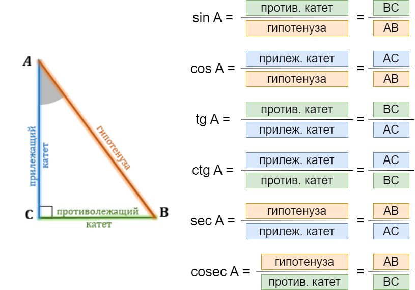<kbd>

#### Таблица значений тригонометрических функций
Основные значения тригонометрических функций углов приведены в таблице.

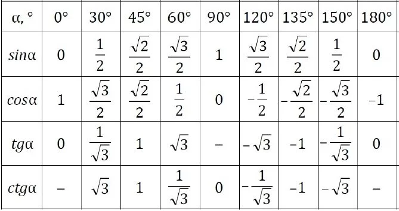  
Ниже встречаются необязательные вставки с дополнительной информацией (история просходждения тех или иных идей, интересные факты). Вы
можете развернуть каждый раздел, чтобы увидеть подробности.
<details>
  <summary><b>Правило левой ладони</summary></b>  

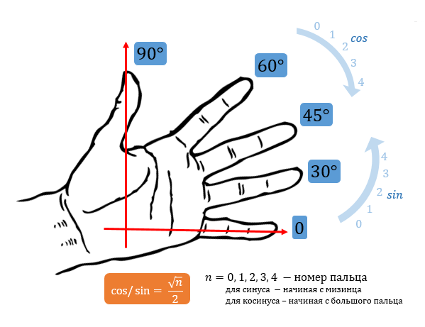 
</details>
    
<details>
  <summary><b>Почему в окружности 360 градусов и кто выбрал именно такое количество?</summary></b>  
Обратимся к вопросу, почему было выбрано количество, равное именно 360 градусам,  и кто первым поделил окружность на равные части. Считается, что этим открытием мы обязаны Древнему Вавилону. В истории человечества встречаются различные системы счисления – например, двоичная, десятеричная и т.д. У вавилонцев была шестидесятеричная. Число 60 было для них ритуальным. Столько насчитывалось богов в Древнем Вавилоне. Причем у каждого было свое числовое обозначение от 1 до 60. Например, творец вселенной Бел шел под номером 20, у бог луны Син – под 30-м.  

Число 60 стало основой для календаря Древнего Вавилона. Люди наблюдали, как по кругу движутся луна и солнце, и решили, что год состоит примерно из 360 дней. Поэтому окружность они разделили именно на столько частей – по одному градусу на каждый день. Слово gradus в переводе с латыни означает «шаг, ступень». Словно солнце за сутки делало один шаг. В одном из храмов Древнего Вавилона находилась статуя бога, которая была окружена 360 кувшинами. Каждый символизировал один из дней. Позже шестидесятеричная система счисления стала основой для деления времени. В одном часе – 60 минут, в одной минуте – 60 секунд.

Помимо сказанного, у числа 360 делителей целых 24 делителя. Если в круге 360 градусов, такой круг легко поделить на части разными способами.

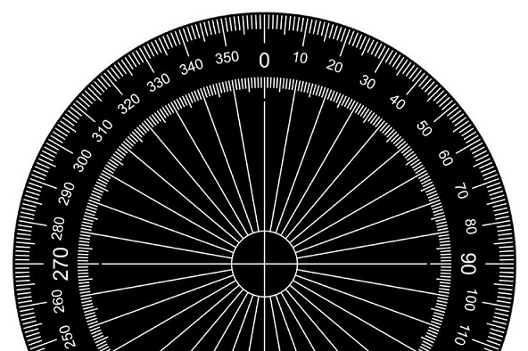  
</details>

### 2. Понятие радиана 
> **1 радиан** – это центральный угол, опирающийся на дугу, длина которой равна радиусу окружности.  
> 1 радиан приблизительно равен 57 градусам 17 минут 45 секунд.


Полный круг составляет 360 градусов. Длина окружности <code>***L = 2πr***</code>.

Угол в 1 радиан опирается на дугу окружности, равную <code>***r***</code>. Мы получаем, что угол в один радиан соответствует дуге окружности, равной r, радиусу окружности. 
```bash
360 градусов --------- 2πr
1 радиан     --------- r.
```
Во сколько же раз полный круг больше, чем 1 радиан? - Очевидно, в <code>***2π***</code> раз. 

360 градусов соответствует <code>***2π***</code> радианам.  
180 градусов соответствует <code>***π***</code> радианам.  
90 градусов – это $\frac{π}{2}$ радиан.  


<details>
  <summary><b>Примеры на перевод единиц</summary></b>  
    
#### Пример 1.
    
Найти радианную меру угла 60°.  
Решение: Т.к. 180° = π ⇒ 1° =  $\frac{π}{180}$ ⇒ 60° =  $\frac{π}{3}$   
#### Пример 2. 
Найти градусную меру угла $\frac{3π}{4}$.   
Решение: Т.к. π = 180 ∘ ⇒ $\frac{3π}{4}$ = $\frac{3}{4}$ ⋅ 180° = 135°.   

Обычно пишут, например, не $\frac{π}{4}$  рад , а просто $\frac{π}{4}$ (т.е. единицу измерения "рад" опускают). Обратим внимание, что обозначение градуса при записи угла не опускают. Таким образом, под записью “угол равен 1 ” понимают, что "угол равен 1 радиану", а не "угол равен 1 градусу".   

Известно,что π ≈ 3,14, а 1 рад ≈ 57°. Такую приблизительную подстановку делать в задачах нельзя, но возможность быстро прикинуть значение того или иного угла часто помогает при решении некоторых задач. Например, таким образом проще найти на окружности угол в 5 радиан: он примерно равен 285°.

</details>

  

### 3. Единичная окружность
> Тригонометрическая (единичная) окружность – окружность радиусом, равным одному и с центром в начале координат.

Рассмотрим прямоугольную систему координат и в ней окружность с единичным радиусом и центром в начале координат.   
Угол в 1° — это такой центральный угол, который опирается на дугу, длина которой равна $\frac{1}{360}$ длины всей окружности.  

Будем рассматривать на окружности такие углы, у которых вершина находится в центре окружности, а одна сторона всегда совпадает с положительным направлением оси <code>***Ох***</code> (на рисунке выделено красным). На рисунке таким образом отмечены углы 45°, 180°, 240°:  

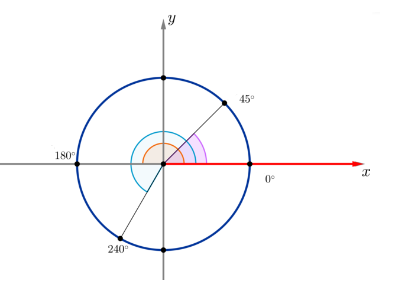

Заметим, что угол 0° — это угол, обе стороны которого совпадают с положительным направлением оси <code>***Ох***</code>.

Поворот по окружности ***против часовой стрелки*** — это поворот на положительный угол. Поворот ***по часовой стрелке*** — это поворот на отрицательный угол. Например, на рисунке отмечены углы − 45°, − 90°, − 160°:


Рассмотрим точку _P_ (30°) на окружности. Для того, чтобы совершить поворот по окружности из начального положения до точки _P_ (30°), необходимо совершить поворот на угол 30° (оранжевый). Если мы совершим полный оборот (то есть на 360°) и еще поворот на 30°, то мы снова попадем в эту точку, хотя уже был совершен поворот на угол 390° = 360° + 30° (голубой). Также попасть в эту точку мы можем, совершив поворот на − 330° (зеленый), на 750° = 360° + 360° + 30° и т.д.

Таким образом, каждой точке на окружности соответствует бесконечное множество углов, причем отличаются эти углы друг от друга на целое число полных оборотов.


Все углы, находящиеся в точке 30° можно записать в виде:  
```bash
α = 30° + n ⋅ 360°,   n ∈ Z
```
Ордината точки _P_ на единичной окружности – синус угла _α_, абсцисса точки _P_ – косинус угла _α_. Отрезок [-1; 1] на оси <code>***Оу***</code> –линия синусов, отрезок [-1; 1] на оси <code>***Ох***</code> – линия косинусов.
Прямая x = 1 – линия (ось) тангенсов, прямая y = 1 – линия (ось) котангенсов.

Ось тангенсов проходит через точку (1; 0) параллельно оси синусов, причем положительное направление оси тангенсов совпадает с положительным направлением оси синусов; ось котангенсов — через точку (0 ; 1) параллельно оси косинусов, причем положительное направление оси котангенсов совпадает с положительным направлением оси косинусов.  
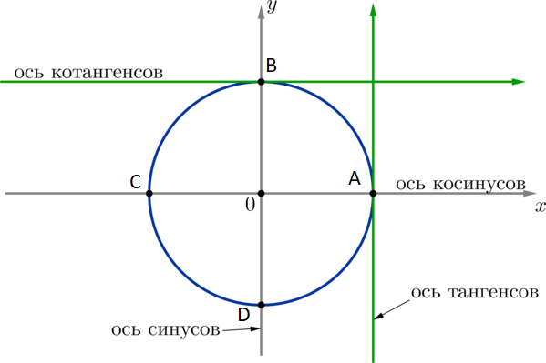  

Обратите внимание еще на один факт: координаты любой точки на окружности обязательно будут больше минус единицы и меньше единицы. Это значит, что значения синуса и косинуса лежат в этом же промежутке. Синус и косинус – это ограниченные функции.  
```bash
sin(α) ∈ [−1;1]
cos(α) ∈ [−1;1]
```
#### Несколько важных свойств тангенса и котангенса
1. Из построения можно заметить, что для любых углов из первой и третьей четвертей котангенс и тангенс будут положительные, а для второй и четвертой – отрицательные;
2. Тангенс и котангенс – неограниченные функции. Это значит, что они могут принимать абсолютно любые значения: 
```bash
tg(α) ∈ (−∞;+∞)
ctg(α) ∈ (−∞;+∞)
```
3. Тангенс не существует для углов на окружности в точках B и D.
4. Котангенс не существует от углов на окружности в точках A и C.
   
На рисунке ниже показаны популярные углы единичной окружности в градусах и радианах.  

  
На рисунке ниже показаны табличные углы единичной окружности в градусах и значения их тригонометрических функций.  

  

<details>
  <summary><b>Примеры на отображение углов на окружности</summary></b>  
    
#### Пример 1.
Изобразить на тригонометрической окружности синус и косинус угла $\frac{π}{3}$ = 60°.
#### Пример 2.
Изобразить на тригонометрической окружности котангенс угла $\frac{π}{6}$.
</details>

#### Четверти единичной окружности
Окружность можно разбить на 4 четверти, как показано на рисунке.

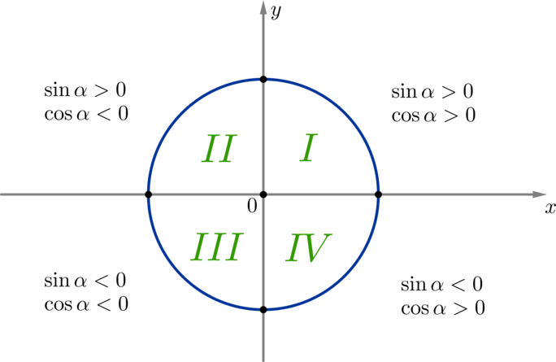

Т.к. в _I_ четверти и абсциссы, и ординаты всех точек положительны, то косинусы и синусы всех углов из этой четверти также положительны. 

Т.к. во _II_ четверти ординаты всех точек положительны, а абсциссы — отрицательны, то косинусы всех углов из этой четверти — отрицательны, синусы — положительны. Аналогично можно определить знак синуса и косинуса для оставшихся четвертей.

<details>
  <summary><b>Примеры на определение четверти</summary></b>  

#### Пример 1.
Какой четверти числовой окружности принадлежит точка, соответствующая числу: а) 4; б) 8 в) – 9; г) 31?  
Решение:  
Полный оборот равен 2п рад или 6,28 рад.  
Угол соответствующий одной четверти  равен 6,28/4 = 1,57 рад.  
Границы четвертей:  
1-я:  от 0 до 1,57 рад.  
2-я: от 1,57 до 3,14 рад.  
3-я: от 3,14 до  (3,14 + 1,57) или от  3,14 до 4,71 рад.  
4-я: от  4,71 до 6,28 рад.  
Положение точки не изменится при добавлении к углу или вычитании из угла целого числа оборотов.  
а) Ответ: точка, заданная углом в 4 рад принадлежит 3-й четверти.  
б) Вычтем 1 полный оборот: 8 - 6,28 = 1,72 рад.  
Ответ: точка во 2-й четверти:  
в) Прибавим 2 полных оборота: -9 + 2 * 6,28 = -9 + 12,56 = 3,56 рад.  
Ответ: точка в 3-й четверти.  
г) Вычтем 4 полных оборота: 31 - 6,28 * 4 = 31 - 25,12 = 5,88 рад.  
Ответ: точка в 4-й четверти.  
</details>


#### Симметрия (четность и нечетность функций)

Напомним, что функция _f(x)_ называется четной, если _f(− x) = f(x)_.   Функция называется нечетной, если _f(− x) = − f(x)_.

Обратите внимание, что координаты точек по оси x буду одинаковые, а значит и значения косинусов углов, соответствующих этим точкам, будут одинаковы:
```bash
cos(α) = cos(−α)
cos(α) = − cos(180 − α)
```

  
Таким образом, косинус — ***четная функция***.

А вот координаты по оси y будут равны по модулю, но противоположны по знаку. Это дает нам следующие соотношения:
```bash
sin(−α) = − sin(α)
sin(α) = sin(180 − α)
```
  
Таким образом, синус — ***нечетная функция***.

Тангенс и котангенс — ***нечетные функция***.

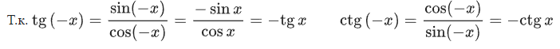  

Значения тангенса углов β и β+180° одинаковы, т.к. они пересекают ось тангенсов в одной точке.
```bash
tg(β) = tg(β+180)
```
При этом, если отложить на окружности угол, равный −β, получим:
```bash
tg(β) = − tg(−β)
tg(−β) = − tg(β)
```
Абсолютно аналогичные рассуждения можно провести и для котангенса:
```bash
ctg(β) = ctg(β + 180)
ctg(β) = − ctg(180 − β)
```
Рассмотренные выше формулы называются ***формулами приведения***. 

## Формулы приведения
Тригонометрия на окружности имеет некоторые закономерности. 
Часто в задачах встречаются выражения вида cos($\frac{3π}{2}$+x), sin($\frac{π}{2}$-x), tg($\frac{π}{2}$+x), а также sin(x+π) или cos (π-x) — то есть такие, где к аргументу прибавляется нечетное число, умноженное на $\frac{π}{2}$, или целое число, умноженное на _π_. Они упрощаются с помощью формул приведения.

Запомните: формулы приведения, от слова «привести». К привидениям, т.е. к призракам и прочим глюкам, эти формулы отношения не имеют.

Эти формулы называются так потому, что с их помощью можно _привести_ выражения к более простым.  

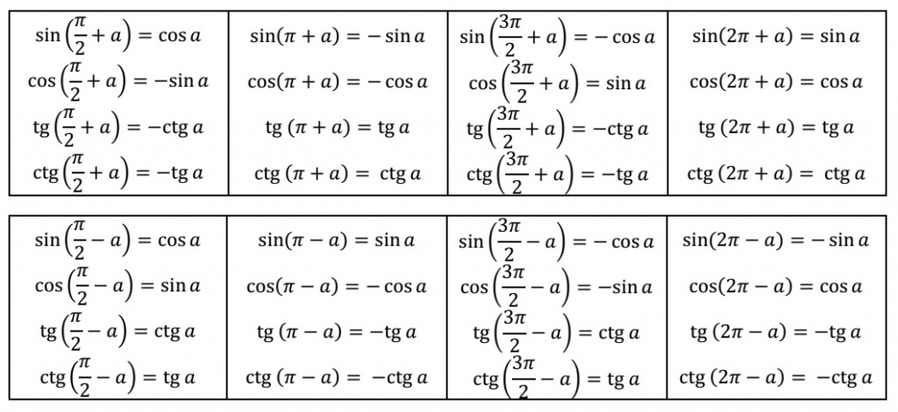  

> ***Кофункция*** - это противоположная функция (с добавлением или убиранием приставки «ко-»). Для **ко**синуса - это синус и наоборот. Для тангенса - это **ко**тангенс и наоборот.

### ПРАВИЛО ЛОШАДИ

Достаточно знать правило, состоящее из двух пунктов.

1) Если в тригонометрической формуле к аргументу прибавляется (или вычитается из него) $\frac{π}{2}$; $\frac{3π}{2}$; $\frac{7π}{2}$ — в общем, угол, ***лежащий на вертикальной оси***, — функция _меняется на кофункцию_. Синус меняется на косинус, косинус на синус, тангенс на котангенс и наоборот.
   Если же мы прибавляем или вычитаем _π_, _3π_, _5π_  — в общем, то, что ***лежит на горизонтальной оси***, — функция на кофункцию _не меняется_.

Как легко запомнить данное правило? Если прибавляемый угол лежит на вертикальной оси — вертикально  $\color{blue} {киваем}$  $\color{blue} {головой}$, говорим: «Да, да, меняется функция на кофункцию». Если прибавляемый угол лежит на горизонтальной оси — горизонтально $\color{blue} {мотаем}$  $\color{blue} {головой}$, говорим: «Нет, нет, не меняется функция на кофункцию».

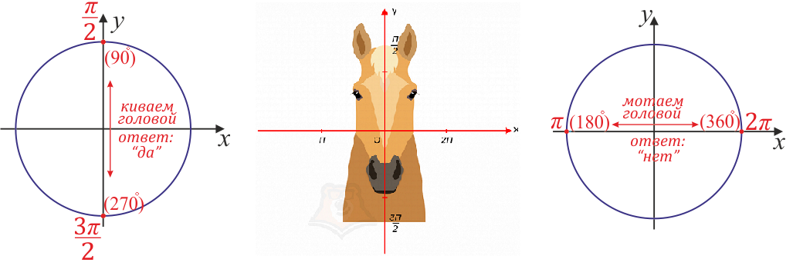 

2) Знак получившегося выражения такой же, каким был знак исходной тригонометрической функции в исходной четверти, при условии, что аргумент мы берем из первой четверти.

Упростим, например, выражение cos($\frac{π}{2}$+x). Функция меняется на кофункцию — и в результате получится синус. Взяв x из первой четверти и прибавив к нему $\frac{3π}{2}$, попадем во вторую четверть. Во второй четверти косинус отрицателен, т.е. получится <code>-sinx</code>.

<details>
  <summary><b>Примеры из ЕГЭ</summary></b>  

#### Пример 1.
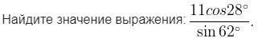
<details>
  <summary><b>Решение</summary></b>  

Углы 62° и 28° нестандартные, поэтому «в лоб» без калькулятора вычислить непросто. Однако использовав формулы приведения, мы легко найдем правильный ответ. Прежде всего, обратите внимание на один важный момент: 
```bash
28° = 90°−62°
```
Поэтому мы можем заменить 28° на выражение 90°−62°.  
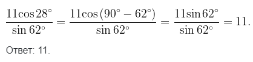
</details>
    
#### Пример 2.
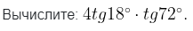
<details>
  <summary><b>Решение</summary></b>  
    
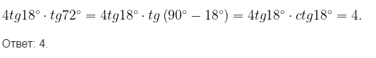
</details>
    
#### Пример 3.
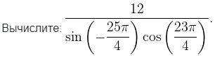
<details>
  <summary><b>Решение</summary></b>  
    
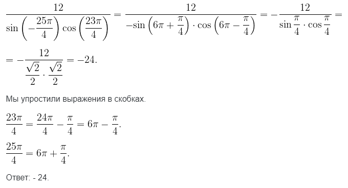
</details>
    
#### Пример 4.

<details>
  <summary><b>Решение</summary></b>  
    
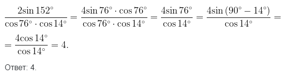
</details>
    
#### Пример 5.
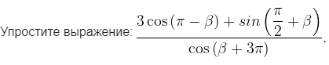
<details>
  <summary><b>Решение</summary></b>  
    
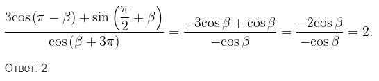
</details>
    
#### Пример 6.
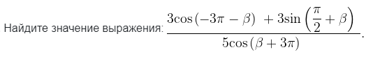
<details>
  <summary><b>Решение</summary></b>  
    
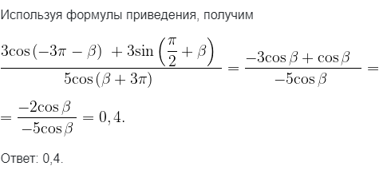
</details>
    
#### Пример 7.
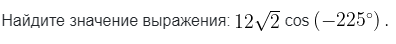
<details>
  <summary><b>Решение</summary></b>  
    
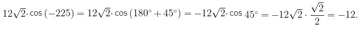
</details>
    
#### Пример 8.
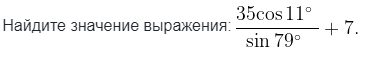
<details>
  <summary><b>Решение</summary></b>  
    

</details>
    
#### Пример 9.
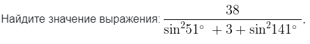
<details>
  <summary><b>Решение</summary></b>  
    
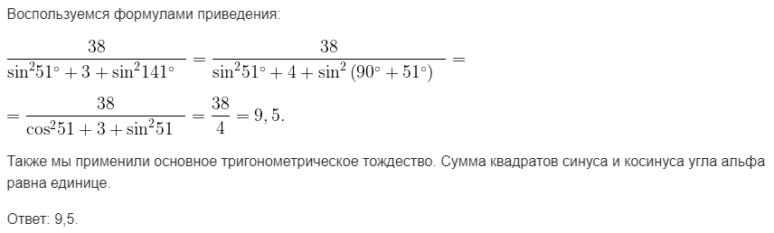
</details>

</details>


## Основное тригонометрическое тождество

## Формулы сложения

Тригонометрические формулы сложения показывают то, как тригонометрические функции суммы или разности двух углов находят свое выражение через тригонометрические функции этих углов. Данные формулы являются базой для вывода формул двойного и тройного угла, а также понижения степени.

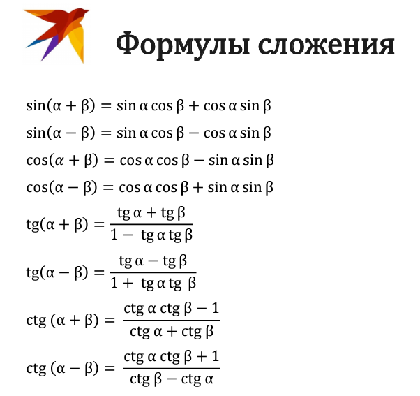

## Формулы двойного угла  

Формулы двойного угла выражают синус, косинус, тангенс и котангенс угла _2α_ через тригонометрические функции угла. Данные формулы следуют из формул сложения. Формулы двойного угла используются преимущественно для преобразования тригонометрических выражений.

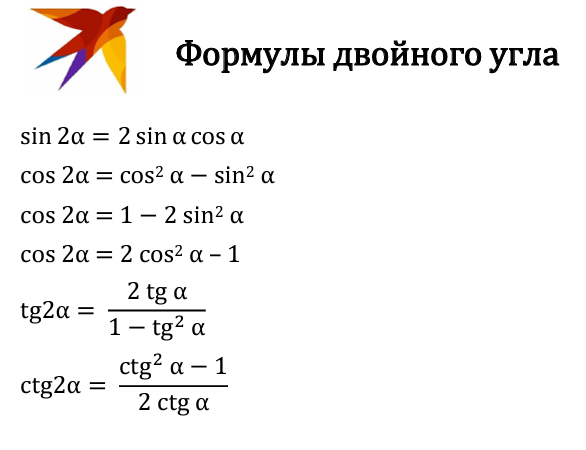

## Формулы тройного угла  

По аналогии с формулами двойного угла мы можем получить формулы тройного угла. Для этого опять-таки используются формулы сложения, а также формулы двойного угла.

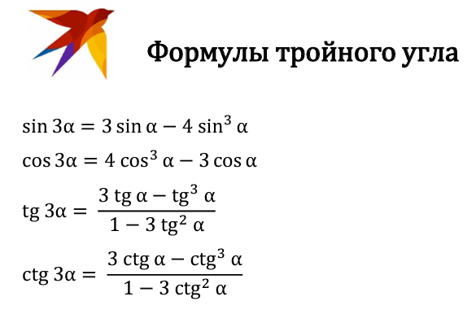

## Формулы понижения степени  

Тригонометрические формулы понижения степени дают возможность понизить степени тригонометрических функций до первой. Эти формулы помогают переходить от натуральных степеней тригонометрических функций к синусам и косинусам в первой степени, но кратных углов.

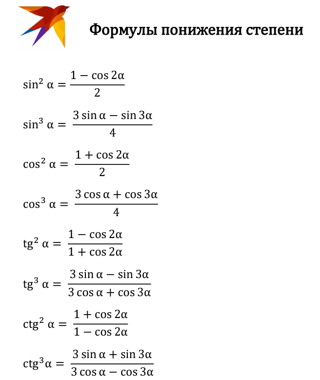

## Формулы преобразования суммы в произведение

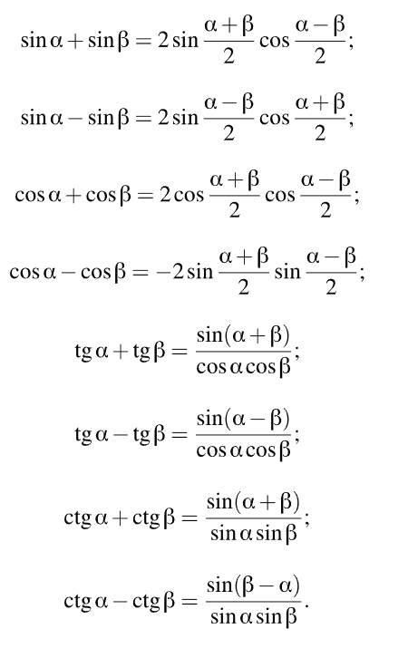

## Формулы преобразования произведения в сумму

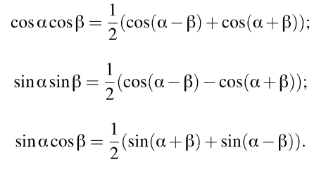

## Лайфхаки и советы
Стоит запомнить основные методы решения заданий по тригонометрии.   
Следует учесть, что, выполняя задачи, вы должны привести уравнение к простейшему виду. Сделать это можно следующим образом:  
🔥 разложив уравнение на множители;   
🔥 заменив переменную (сведение к алгебраическим уравнениям);   
🔥 приведя к однородному уравнению; перейдя к половинному углу;   
🔥 преобразовав произведения в сумму; введя вспомогательный угол;   
🔥 использовав способ универсальной подстановки. 

При этом чаще всего учащемуся приходится в ходе решения использовать несколько из перечисленных методов.

## FAQ  

> Frequently Asked Questions, т.е. часто задаваемые вопросы
> 
#### Question №1  
Еще раз проговорим этот важный момент: с точки зрения формулы приведения $\frac{7π}{2}$ - это тоже самое, что и $\frac{3π}{2}$. Почему? Потому что $\frac{7π}{2}$ \= $\frac{3π+4π}{2}$ \= $\frac{3π}{2}$ + $\frac{4π}{2}$ \= $\frac{3π}{2}$ + _2π_. Иными словами, они отличаются ровно на один оборот _2π_. А на значения тригонометрических функций количество оборотов никак не влияет:
```bash
cos t = cos(t+2π) = cos(t+4π) = cos(t+6π) =...= cos(t−2π) = cos(t−4π) = cos(t−6π) = …  
sin t = sin(t+2π) = sin(t+4π) = sin(t+6π) =...= sin(t−2π) = sin(t−4π) = sin(t−6π) = …
```
Аналогично с тангенсом и котангенсом (только у них «оборот» равен π).
```bash
tg t = tg(t+π) = tg(t+2π) = tg(t+3π) =...= tg(t−π) = tg(t−2π) = tg(t−3π) = …  
ctg t = ctg(t+π) = ctg(t+2π) = ctg(t+3π)=...=ctg(t−π) = ctg(t−2π) = ctg(t−3π) = …
```
Таким образом,  
−ctg($\frac{7π}{2}$+a) = −ctg($\frac{3π}{2}$+2π+a) = −ctg($\frac{3π}{2}$+a).

То есть, для определения знака и необходимости смены функции важно лишь местоположение «точки привязки», а не её значение, поэтому так расписывать не обязательно.
#### Question №2
Вопрос: Есть ли формулы приведения с аргументами ($\frac{π}{3}$− _a_), ($\frac{π}{4}$− _a_), ($\frac{7π}{6}$+ _a_) или тому подобное?   

Ответ: К сожалению, нет. В таких ситуациях выгодно использовать формулы разности и суммы аргументов. 
Например,  
cos($\frac{π}{3}$− _a_) = cos $\frac{π}{3}$ cos _a_ + sin $\frac{π}{3}$ sin _a_ = $\frac{1}{2}$ cos _a_ + $\frac{√3}{2}$ sin _a_.

#### Question №3
Вопрос: Как доказывать тождество??   

Ответ: Чтобы доказать тождество нужно доказать, что его правая и левая части равны, т.е. свести его к виду «выражение» = «такое же выражение». 
Для того, чтобы это сделать, можно:
* преобразовывать только правую или только левую часть;
* преобразовывать обе части одновременно;
* использовать любые допустимые математические преобразования (например, приводить подобные; раскрывать скобки; переносить слагаемые из одной части в другую, меняя знак; умножать или делить левую и правую часть на одно и то же число или выражение, не равное нулю и т.д.);
* использовать любые математические формулы.
  
Пример. Доказать тригонометрическое тождество 
```bash
sin 2x = 2sinx ⋅ cosx
```
<details>
  <summary><b>Решение</summary></b>  

```bash
sin2x = 2sinx ⋅ cosx
```
            	
Будем преобразовывать левую часть. Представим _2x_ как _x + x_:
```bash
sin(x + x) = 2sinx ⋅ cosx
```
Распишем по формуле для синуса суммы аргументов. 
```bash
sinx ⋅ cosx + sinx ⋅ cosx = 2sinx ⋅ cosx
```
А теперь приведем подобные слагаемые.
```bash
2sinx ⋅ cosx = 2sinx ⋅ cosx
```
Левая часть равна правой – тождество доказано.

</details>

## Полезные ссылки
| **ОПИСАНИЕ** | **ССЫЛКА** |
|:---------:|:---------:|
| Видеолекции по темам к ЕГЭ| [http://cos-cos.ru/](http://cos-cos.ru/)| 
| Формулы по тригонометрии| [https://educon.by/index.php/materials/math/trigonometria](https://educon.by/index.php/materials/math/trigonometria) |
| CSS color names| [https://doka.guide/css/web-colors/#nazvanie-cveta](https://doka.guide/css/web-colors/#nazvanie-cveta) | 
| Web gradients| [https://webgradients.com/](https://webgradients.com/) | 
| Lists in HTML | [https://html5book.ru/html-lists/](https://html5book.ru/html-lists/) | 
| 30 CSS selectors | [https://webdesign.tutsplus.com/ru/the-30-css-selectors-you-must-memorize--net-16048t](https://webdesign.tutsplus.com/ru/the-30-css-selectors-you-must-memorize--net-16048t) |
| HTML Special Characters| [https://html5book.ru/specsimvoly-html/](https://html5book.ru/specsimvoly-html/) | 

[Назал к содержанию](#-содержание)


